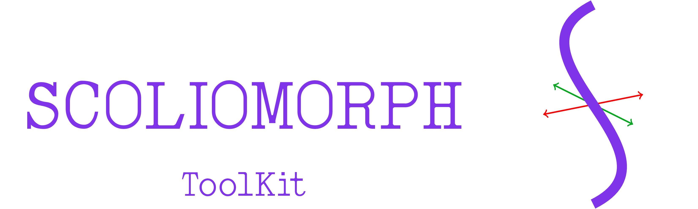

# Scoliomorph: A Spatial Orientation Analysis Library for Vertebral Body Point Cloud

This library provides tools to load [STL](stl/01_CTACardio%20segmentation_L3%20vertebra.stl) files, compute pitch, roll, and yaw angles based on the principal axes, and visualize the results.

## Method
See the [Method Description](doc/Method.pdf) with figures.

## Installation 

### Option 1: Install Directly from GitHub

You can install Scoliomorph directly from the GitHub repository using `pip`:

```bash
pip install git+https://github.com/raviumadi/scoliomorph.git
```

### Option 2 - Git clone and Install

### 1. Clone the Repository 

```bash
git clone git@github.com:raviumadi/scoliomorph.git
cd scoliomorph/
pip install -e .
```

### 2. Setup a virtual environment (optional but recommended)
If you don’t already have a virtual environment set up:

```bash
# Create virtual environment
python3 -m venv .venv

# Activate virtual environment
source .venv/bin/activate  # On Linux/macOS
# .\.venv\Scripts\activate  # On Windows
```
### 3. Install the package

```bash 
pip install -e . 
```
 
## Usage

### 1. Load STL Files and Perform Analysis

You can use the scoliomorph package to load STL files, calculate pitch, roll, and yaw, and plot the results. Here’s an example:

```python
from scoliomorph.analysis import load_stl_file, calculate_principal_axes, plot_2d_angles_with_labels
import os

# Path to the STL file (assumes 'stl' directory is at the same level as your script)
stl_file_path = os.path.join(os.path.dirname(__file__), '..', 'stl', 'example.stl')

# Load the STL file
points = load_stl_file(stl_file_path)

# Calculate pitch, roll, and yaw
pitch, roll, yaw, centroid, centered_points, principal_axes = calculate_principal_axes(points)

# Plot the results
plot_2d_angles_with_labels(pitch, roll, yaw, principal_axes, centered_points)
```
### 2. Running Examples

There are example scripts provided in the examples/ folder. To run them, follow these steps:
```bash 
cd examples
python example_X.py
```

## Library Functions

- `load_stl_file()`
  - Load STL file and extract the points from the mesh.

- `calculate_principal_axes()`
  - Calculate pitch, roll, yaw based on the principal axes of the point cloud.

- `calculate_vbc_profile()`
  - Calculate the vertebral column geometric properties for each STL file in the folder.

- `plot_2d_angles_with_labels()`
  - Plot the pitch, roll, yaw along with the point cloud projections.

- `plot_point_cloud_fixed_axes()`
  - Plot the point cloud with fixed global coordinate system and angular lines.

- `plot_stl_files()`
  - Function to load STL files from a folder, align points to (x, y) = (0, 0), and plot them.

    **Parameters:**
    - folder_path : str
        - Path to the folder containing STL files.
    - plot_type : str
        - Type of plot ('pointcloud' or 'mesh'). Default is 'pointcloud'.
    - color : str
        - Color for the plot (e.g., 'red', 'blue'). Default is 'blue'.
    - alpha : float
        - Transparency level for the plot (0.0 to 1.0). Default is 1.0 (opaque).

- `plot_vbc_profile()`
  - Plot the point cloud centroids of the vertebral column units with pitch, roll, and yaw vectors

- `normalize_angles()`
  - Normalize pitch, roll, and yaw to stay within the range [-90°, +90°]
by converting them to their complementary angles if they exceed 90° or -90°.

- `set_axes_equal()`
  - Set 3D plot axes to equal scale.

- `normalize_angle()`
  - Normalize an individual angle to stay within [-90°, 90°].

## Cite as 

If you use this project in your research, please cite it as follows:

```bibtex
@misc{umadi2024project,
  author = {Ravi Umadi},
  title = {Scoliomorph: A Spatial Orientation Analysis Library for Vertebral Body Point Cloud},
  year = {2024},
  publisher = {GitHub},
  journal = {GitHub repository},
  howpublished = {\url{https://github.com/raviumadi/scoliomorph}},
  version = {1.0}
  note = {Klinikum rechts der Isar, TUM School of Medicine, Klinik für Orthopädie und Sportorthopädie, Ismaninger Str. 22, 81675 München}
}
```
## Contributing

If you’d like to contribute, feel free to open issues or submit pull requests.

## License

This project is licensed under the MIT License - see the [LICENSE](LICENSE.md) file for details.


## Bibliography
1. Masharawi, Youssef and Salame, Khalil and Mirovsky, Yigal and Peleg, Smadar and Dar, Gali and Steinberg, Nili and Hershkovitz, Israel, "Vertebral body shape variation in the thoracic and lumbar spine: {Characterization} of its asymmetry and wedging", *Clinical Anatomy*, 2008, 21(1), 46--54.

2. Vrtovec, Tomaž and Pernuš, Franjo and Likar, Boštjan, "A review of methods for quantitative evaluation of axial vertebral rotation", *European Spine Journal*, 2009, 18(8), 1079--1090.

3. Galbusera, Fabio and Niemeyer, Frank and Bassani, Tito and Sconfienza, Luca Maria and Wilke, Hans-Joachim, "Estimating the three-dimensional vertebral orientation from a planar radiograph: {Is} it feasible?", *Journal of Biomechanics*, 2020, 102(), 109328.

4. Lecron, Fabian and Benjelloun, Mohammed and Mahmoudi, Saïd, *Fully automatic vertebra detection in x-ray images based on multi-class {SVM}*, 2012.

5. Goris, B. C. E. and Kuipers, M. and De Vries, J. and Wever, D. J. and Verkerke, G. J. and Veldhuizen, A. G., "On the {Determination} of the {Angular} {Orientation} of a {Vertebra}", *Journal of Biomechanical Engineering*, 2002, 124(1), 134--136.

