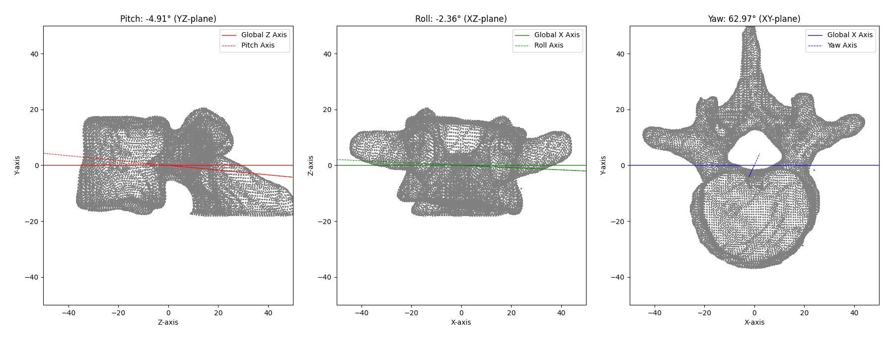
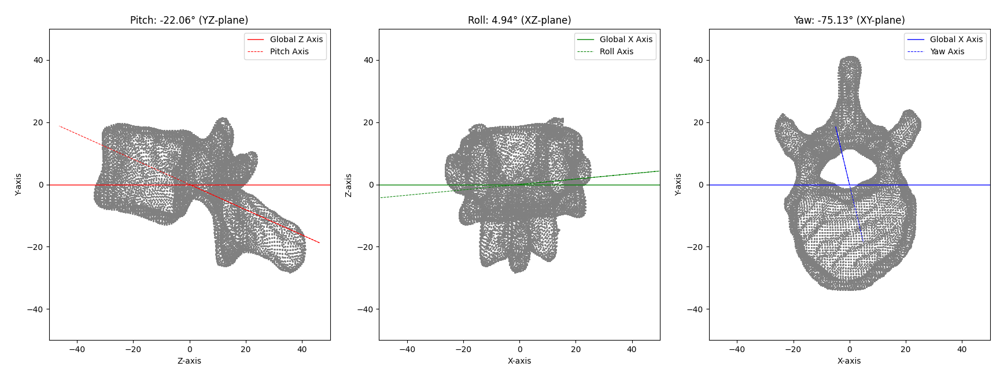
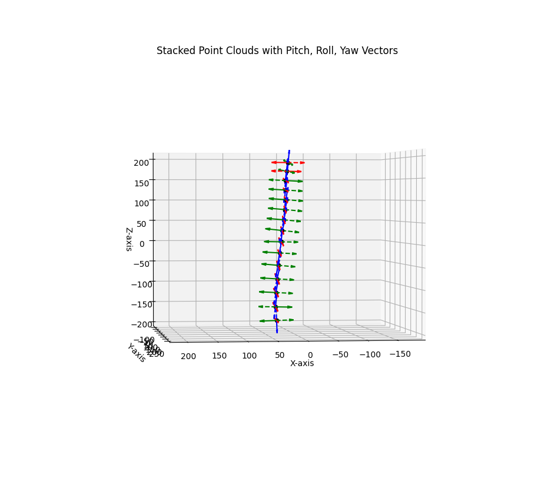
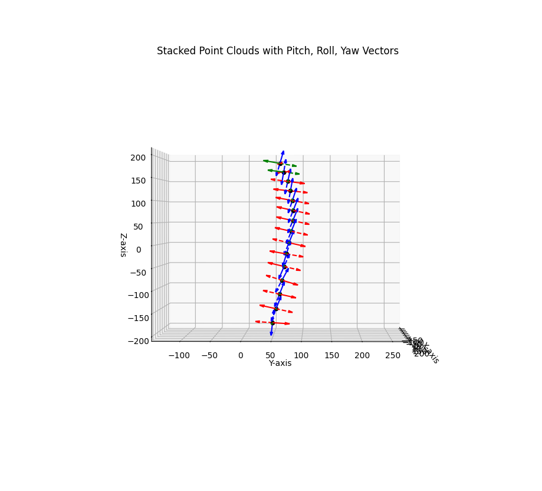
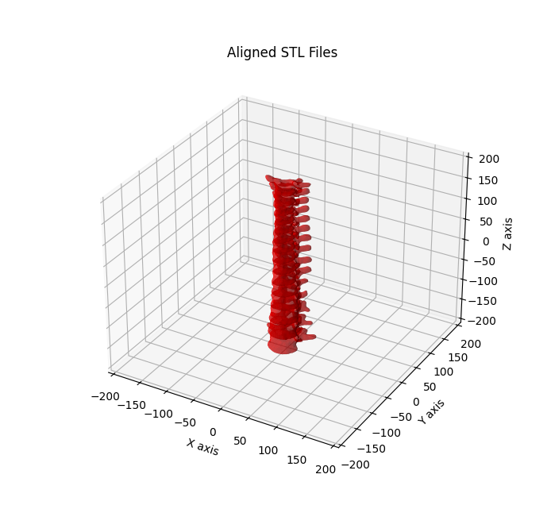

# Scoliomorph: An STL Analysis Library for Vertebral Body Point Cloud

This library provides tools to load STL files, compute pitch, roll, and yaw angles based on the principal axes, and visualize the results.

## Data
The example stl files are extracted using [Auto3DSeg](https://github.com/lassoan/SlicerMONAIAuto3DSeg) extension for [3D Slicer](https://www.slicer.org) using the example dataset. The segmentation was exported as .stl and the files were inspected and extra vertices were cleaned up using [Blender](https://www.blender.org).

## Results
To interpret the rotational angles, see [Rotational Reference](examples/rotation.txt).

### L3


### T12


### Cloumn 




## Installation
### Option 1: Install Directly from GitHub

You can install Scoliomorph directly from the GitHub repository using `pip`:

```bash
pip install git+https://github.com/raviumadi/scoliomorph.git
```

### Option 2 - Git clone and Install

### 1. Clone the Repository

```bash
git clone git@github.com:raviumadi/scoliomorph.git
cd scoliomorph/
pip install -e .
```

### 2. Setup a virtual environment (optional but recommended)
If you don’t already have a virtual environment set up:

```bash
# Create virtual environment
python3 -m venv .venv

# Activate virtual environment
source .venv/bin/activate  # On Linux/macOS
# .\.venv\Scripts\activate  # On Windows
```
### 3. Install the package

```bash 
pip install -e . 
```

## Usage

### 1. Load STL Files and Perform Analysis

You can use the scoliomorph package to load STL files, calculate pitch, roll, and yaw, and plot the results. Here’s an example:

```python
from scoliomorph.analysis import load_stl_file, calculate_principal_axes, plot_2d_angles_with_labels
import os

# Path to the STL file (assumes 'stl' directory is at the same level as your script)
stl_file_path = os.path.join(os.path.dirname(__file__), '..', 'stl', 'example.stl')

# Load the STL file
points = load_stl_file(stl_file_path)

# Calculate pitch, roll, and yaw
pitch, roll, yaw, centroid, centered_points, principal_axes = calculate_principal_axes(points)

# Plot the results
plot_2d_angles_with_labels(pitch, roll, yaw, principal_axes, centered_points)
```
### 2. Running Examples

There are example scripts provided in the examples/ folder. To run them, follow these steps:
```bash 
cd examples
python example_X.py
```
## Contributing

If you’d like to contribute, feel free to open issues or submit pull requests.

## License

This project is licensed under the MIT License - see the [LICENSE](LICENSE.md) file for details.